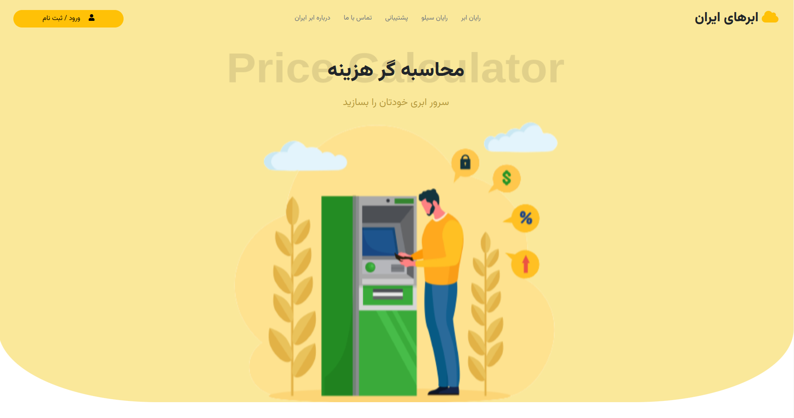
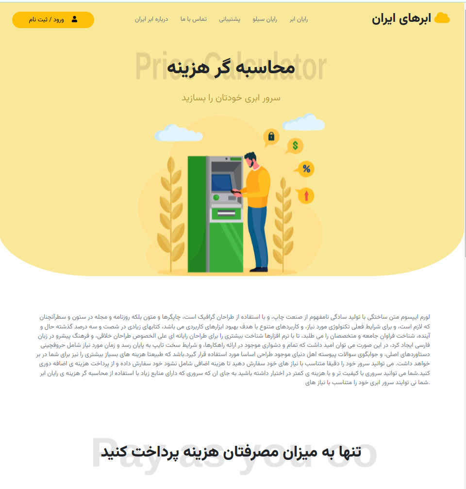

# :fire::fire: Responsive IRan Cloud HOME/DASHBOARD:fire::fire:

this a Admin pannel and home page of Iran cloud  that is powered by Bootsrap and it is totally responsive 

**Section:**

- Nav Bar
- Side bar
- Card 
- Progress and tesk
- Activites and Post
- Tables
- Footer

## Large

<table>
<tr>
    <td></td>
    <td></td>
</tr>
<tr>
    <td></td>
    <td></td>
</tr>
<tr>
    <td></td>
</tr>
</table>

## Mid

<table>
<tr>
    <td></td>
    <td></td>
</tr>
<tr>
    <td></td>
    <td></td>
</tr>
<tr>
    <td></td>
</tr>
</table>

## Small

<table>
<tr>
    <td></td>
    <td></td>
</tr>
<tr>
    <td></td>
    <td></td>
</tr>
<tr>
    <td></td>
    <td></td>
</tr>
</table>

## :technologist: Technologies Used :technologist:

 <ul>
    <li>Html</li>
    <li>Css</li>
    <li>Js</li>
    <li>Bootstrap</li>
</ul>
